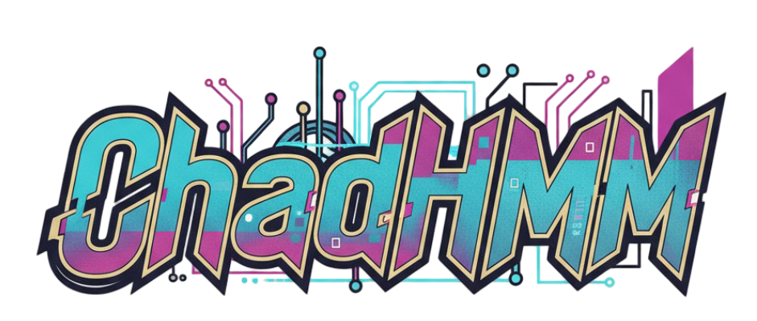

# Chad Hidden Markov Models (ChadHMM)

<div align="center">
  


  [](https://badge.fury.io/py/chadhmm)
  [](https://github.com/GarroshIcecream/ChadHMM/blob/master/LICENSE)
  [](http://makeapullrequest.com)
  [](https://pepy.tech/projects/chadhmm)
  
  [](https://github.com/GarroshIcecream/ChadHMM/actions/workflows/ci.yml)
  [](https://github.com/GarroshIcecream/ChadHMM/actions/workflows/release.yml)
</div>

## Table of Contents

- [About](#about)
- [Installation](#installation)
- [Quick Start](#quick-start)
- [Usage Guide](#usage-guide)
  - [Hidden Markov Models (HMM)](#hidden-markov-models-hmm)
  - [Hidden Semi-Markov Models (HSMM)](#hidden-semi-markov-models-hsmm)
  - [Model Training](#model-training)
    - [Training Mode and Compilation](#training-mode-and-compilation)
  - [Inference and Decoding](#inference-and-decoding)
  - [Model Evaluation](#model-evaluation)
- [Available Distributions](#available-distributions)
- [Roadmap](#roadmap)
- [Unit Tests](#unit-tests)
- [References](#references)

## About

**ChadHMM** is a PyTorch-based library for Hidden Markov Models (HMM) and Hidden Semi-Markov Models (HSMM). It provides a modular, flexible framework for building and training sequential models with various emission distributions.

**Key Features:**
- 🔥 Built on PyTorch for GPU acceleration and automatic differentiation
- 🎯 Support for both HMM and HSMM with explicit duration modeling
- 📊 Multiple emission distributions: Gaussian, Gaussian Mixture, Multinomial, Poisson
- 🎲 Flexible transition types: Ergodic, Left-to-Right, and custom configurations
- 🧮 Efficient inference algorithms: Viterbi, MAP, Forward-Backward
- ⚡ Compiled algorithms with training mode control for optimized performance
- 📈 Model selection tools: AIC, BIC, HQC information criteria

## Installation

### Option 1: Install from PyPI (Recommended)
```bash
# Using pip
pip install chadhmm

# Using uv
uv add chadhmm
```

### Option 2: Development Installation
```bash
# Clone the repository
git clone https://github.com/GarroshIcecream/ChadHMM.git
cd ChadHMM

# Install with uv
uv sync --dev
```

## Quick Start

Here's a minimal example to get started with a Gaussian HMM:

```python
import torch
from chadhmm import HMM
from chadhmm.distributions import (
    GaussianDistribution,
    TransitionMatrix,
    InitialDistribution
)
from chadhmm.schemas import Transitions, DecodingAlgorithm

device = torch.device("mps" if torch.mps.is_available() else "cpu")

# Create distributions
emission_pdf = GaussianDistribution.sample_distribution(
    n_features=4,      # 4-dimensional observations
    n_components=3     # 3 hidden states
)

transition_matrix = TransitionMatrix.sample_from_dirichlet(
    transition_type=Transitions.ERGODIC,
    prior=1.0,
    target_size=torch.Size([3, 3])
)

initial_distribution = InitialDistribution.sample_from_dirichlet(
    prior=1.0,
    target_size=torch.Size([3])
)

# Create HMM model
hmm = HMM(
    transition_matrix=transition_matrix,
    initial_distribution=initial_distribution,
    emission_pdf=emission_pdf,
    device=device
)

# Generate some sample data
X = torch.randn(100, 4, device=device)  # 100 timesteps, 4 features

# Fit the model
hmm.fit(X)

# Predict hidden states
states = hmm.predict(X, algorithm=DecodingAlgorithm.VITERBI)
```

## Usage Guide

### Hidden Markov Models (HMM)

#### Creating an HMM with Gaussian Emissions

```python
import torch
from chadhmm import HMM
from chadhmm.distributions import (
    GaussianDistribution,
    TransitionMatrix,
    InitialDistribution
)
from chadhmm.schemas import Transitions

# Define model parameters
n_states = 3
n_features = 4
device = torch.device("cuda" if torch.cuda.is_available() else "cpu")

# Create Gaussian emission distribution
emission_pdf = GaussianDistribution.sample_distribution(
    n_features=n_features,
    n_components=n_states
)

# Create transition matrix (ergodic: all transitions allowed)
transition_matrix = TransitionMatrix.sample_from_dirichlet(
    transition_type=Transitions.ERGODIC,
    prior=1.0,
    target_size=torch.Size([n_states, n_states])
)

# Create initial state distribution
initial_distribution = InitialDistribution.sample_from_dirichlet(
    prior=1.0,
    target_size=torch.Size([n_states])
)

# Build the HMM
hmm = HMM(
    transition_matrix=transition_matrix,
    initial_distribution=initial_distribution,
    emission_pdf=emission_pdf,
    dtype=torch.float32,
    device=device
)
```

#### Left-to-Right HMM (for temporal sequences)

```python
# Create a left-to-right topology (useful for speech, time series)
transition_matrix = TransitionMatrix.sample_from_dirichlet(
    transition_type=Transitions.LEFT_TO_RIGHT,
    prior=1.0,
    target_size=torch.Size([n_states, n_states])
)

hmm = HMM(
    transition_matrix=transition_matrix,
    initial_distribution=initial_distribution,
    emission_pdf=emission_pdf
)
```

### Hidden Semi-Markov Models (HSMM)

HSMMs extend HMMs by explicitly modeling state durations.

```python
import torch
from chadhmm import HSMM
from chadhmm.distributions import (
    GaussianDistribution,
    TransitionMatrix,
    InitialDistribution,
    DurationDistribution
)
from chadhmm.schemas import Transitions

device = torch.device("cuda" if torch.cuda.is_available() else "cpu")

# Create emission distribution
emission_pdf = GaussianDistribution.sample_distribution(
    n_features=4,
    n_components=3
)

# Create transition matrix
transition_matrix = TransitionMatrix.sample_from_dirichlet(
    transition_type=Transitions.ERGODIC,
    prior=1.0,
    target_size=torch.Size([3, 3])
)

# Create initial distribution
initial_distribution = InitialDistribution.sample_from_dirichlet(
    prior=1.0,
    target_size=torch.Size([3])
)

# Create duration distribution (max duration = 6)
duration_distribution = DurationDistribution.sample_from_dirichlet(
    prior=1.0,
    target_size=torch.Size([3, 6])  # [n_states, max_duration]
)

# Build the HSMM
hsmm = HSMM(
    transition_matrix=transition_matrix,
    initial_distribution=initial_distribution,
    duration_distribution=duration_distribution,
    emission_pdf=emission_pdf,
    dtype=torch.float32,
    device=device
)
```

### Model Training

#### Basic Training

```python
# Single sequence
X = torch.randn(100, 4)  # 100 timesteps, 4 features
hmm.fit(X)
```

#### Training with Multiple Sequences

```python
# Concatenate multiple sequences
X = torch.randn(500, 4)  # Total length = 500
lengths = [100, 150, 250]  # Three sequences

hmm.fit(X, lengths=lengths)
```

#### Training with Custom Parameters

```python
hmm.fit(
    X,
    lengths=[100, 150, 250],
    max_iter=100,           # Maximum EM iterations
    n_init=5,               # Number of random initializations
    tol=1e-4,               # Convergence tolerance
    verbose=True            # Print progress
)
```

#### Training Mode and Compilation

ChadHMM models inherit from `torch.nn.Module` and support training mode control similar to PyTorch. The models use compiled forward/backward algorithms during training for maximum performance, and automatically switch to non-compiled versions during inference to avoid compilation overhead.

```python
# Training mode (uses compiled algorithms for speed)
hmm.train()
hmm.fit(X, max_iter=20)

# Evaluation mode (uses non-compiled algorithms to avoid overhead)
hmm.eval()
predictions = hmm.predict(X_test, algorithm=DecodingAlgorithm.VITERBI)
log_likelihood = hmm.score(X_test)
```

### Inference and Decoding

#### Viterbi Algorithm (Most Likely Path)

```python
from chadhmm.schemas import DecodingAlgorithm

# Find the most likely sequence of states
states = hmm.predict(X, algorithm=DecodingAlgorithm.VITERBI)
print(states)  # tensor([0, 0, 1, 1, 2, 2, ...])
```

#### MAP Decoding (Maximum A Posteriori)

```python
# Find most likely state at each timestep
states = hmm.predict(X, algorithm=DecodingAlgorithm.MAP)
```

#### Decoding Multiple Sequences

```python
X = torch.randn(500, 4)
lengths = [100, 150, 250]

states = hmm.predict(
    X,
    lengths=lengths,
    algorithm=DecodingAlgorithm.VITERBI
)
```

### Model Evaluation

#### Computing Log-Likelihood

```python
# Total log-likelihood
total_log_likelihood = hmm.score(X)

# Log-likelihood per sequence
log_likelihoods = hmm.score(
    X,
    lengths=[100, 150, 250],
    by_sample=True
)
print(log_likelihoods)  # [tensor(-234.5), tensor(-456.7), tensor(-678.9)]
```

#### Information Criteria for Model Selection

```python
from chadhmm.schemas import InformCriteria

# Akaike Information Criterion
aic = hmm.ic(X, criterion=InformCriteria.AIC)

# Bayesian Information Criterion
bic = hmm.ic(X, criterion=InformCriteria.BIC)

# Hannan-Quinn Criterion
hqc = hmm.ic(X, criterion=InformCriteria.HQC)

# For multiple sequences
ics = hmm.ic(
    X,
    lengths=[100, 150, 250],
    criterion=InformCriteria.BIC
)
```

#### Generating Samples

```python
# Generate synthetic data from the model
samples, states = hmm.sample(n_samples=100)
print(samples.shape)  # torch.Size([100, n_features])
print(states.shape)   # torch.Size([100])
```

## Available Distributions

### Emission Distributions

| Distribution | Use Case | Example |
|-------------|----------|---------|
| `GaussianDistribution` | Continuous data, single mode per state | Temperature, stock prices |
| `GaussianMixtureDistribution` | Continuous data, multiple modes per state | Complex time series |
| `MultinomialDistribution` | Count data, discrete observations | Word counts, histograms |
| `PoissonDistribution` | Count data, rare events | Number of events per interval |

### State Distributions

| Distribution | Purpose |
|-------------|---------|
| `InitialDistribution` | Starting state probabilities |
| `TransitionMatrix` | State transition probabilities |
| `DurationDistribution` | State duration probabilities (HSMM only) |

### Transition Types

- `Transitions.ERGODIC`: All state transitions allowed
- `Transitions.LEFT_TO_RIGHT`: Only forward transitions (+ self-loops)
- Custom: Define your own transition matrix

### Covariance Types (for Gaussian models)

- `CovarianceType.FULL`: Full covariance matrix
- `CovarianceType.DIAG`: Diagonal covariance matrix
- `CovarianceType.SPHERICAL`: Spherical (single variance) covariance

## Roadmap

### Planned Features
- [ ] **Contextual Models**
  - [ ] Time-dependent contextual variables
  - [ ] Contextual variables for covariances using GEM (Generalized Expectation Maximization)
  - [ ] Contextual variables for multinomial emissions
  - [ ] Parametric/Conditional HMM support

- [ ] **Model Enhancements**
  - [ ] Auto-regressive HMM/HSMM
  - [ ] Online/streaming learning support
  - [ ] Variational inference methods

- [ ] **Documentation & Examples**
  - [ ] Comprehensive tutorials for each distribution type
  - [ ] Financial time series analysis examples
  - [ ] Speech recognition example
  - [ ] Biological sequence analysis examples

- [ ] **Performance & Scalability**
  - [ ] Distributed training support
  - [ ] Memory-efficient implementations for very long sequences
  - [ ] Mixed precision training

See the [open issues](https://github.com/GarroshIcecream/ChadHMM/issues) for a full list of proposed features and known issues.

## Unit Tests

To run the test suite:

```bash
# Run all tests
uv run pytest

# Run with coverage
uv run pytest --cov=chadhmm

# Run specific test file
uv run pytest tests/test_hmm.py
```

## Contributing

Contributions are welcome! Please feel free to submit a Pull Request. For major changes, please open an issue first to discuss what you would like to change.

See [CONTRIBUTING.md](CONTRIBUTING.md) for more details.

## License

This project is licensed under the MIT License - see the [LICENSE](LICENSE) file for details.

## References

This implementation is based on the following research:

### Hidden Markov Models (HMM)
- Rabiner, L. R. (1989). ["A tutorial on hidden Markov models and selected applications in speech recognition"](https://ieeexplore.ieee.org/document/18626). Proceedings of the IEEE, 77(2), 257-286.

### Hidden Semi-Markov Models (HSMM)
- Yu, S. Z. (2010). ["Hidden semi-Markov models"](https://www.sciencedirect.com/science/article/pii/S0004370209001416). Artificial Intelligence, 174(2), 215-243.
- Kobayashi, H., & Mark, B. L. (1995). ["An efficient forward-backward algorithm for an explicit-duration hidden Markov model"](https://www.researchgate.net/publication/3342828_An_efficient_forward-backward_algorithm_for_an_explicit-duration_hidden_Markov_model). IEEE Signal Processing Letters, 2(1), 11-14.

### Contextual HMM
- Artières, T., Marukatat, S., & Gallinari, P. (2007). ["Online handwritten shape recognition using segmental hidden Markov models"](https://www.researchgate.net/publication/261490802_Contextual_Hidden_Markov_Models). IEEE Transactions on Pattern Analysis and Machine Intelligence, 29(2), 205-217.

## Citation

If you use ChadHMM in your research, please consider citing:

```bibtex
@software{chadhmm2024,
  author = {GarroshIcecream},
  title = {ChadHMM: Hidden Markov Models in PyTorch},
  year = {2024},
  url = {https://github.com/GarroshIcecream/ChadHMM}
}
```

## Acknowledgments

- Built with [PyTorch](https://pytorch.org/)
- Inspired by [hmmlearn](https://github.com/hmmlearn/hmmlearn) and [pomegranate](https://github.com/jmschrei/pomegranate)
